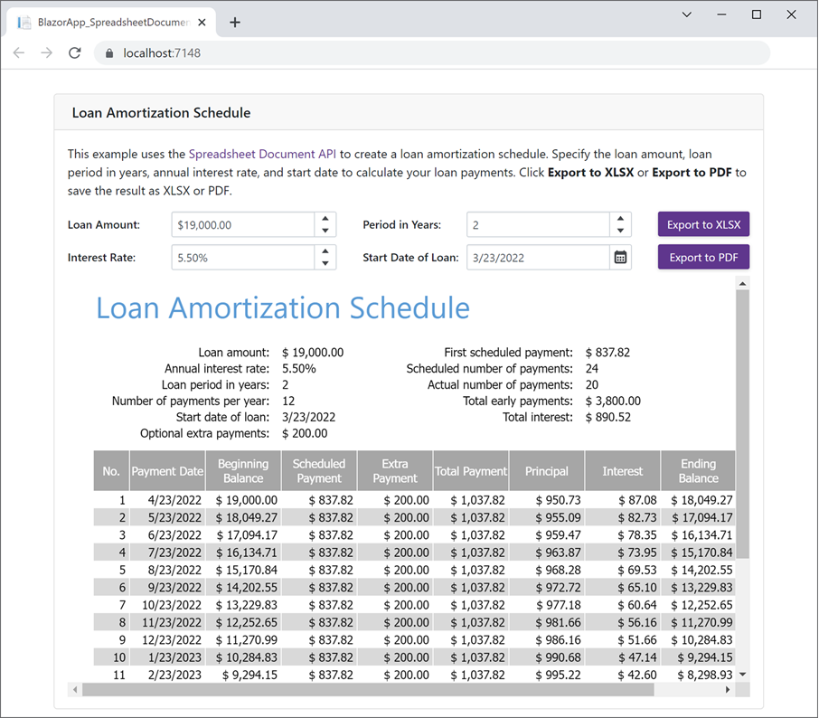

<!-- default badges list -->

<!-- default badges end -->
# Spreadsheet Document API - How to Create a Loan Amortization Schedule within a .NET 6 Blazor Server App

This example demonstrates how to create a Blazor Server application that targets .NET 6 and leverages the capabilities of the [DevExpress Spreadsheet Document API](https://www.devexpress.com/products/net/office-file-api/spreadsheet/) to build a loan amortization schedule.

The application allows users to enter loan information (loan amount, repayment period in years, annual interest rate, and start date). Once data is entered, the Spreadsheet immediately recalculates loan payments and updates data on the application page. Users can export the result to XLSX or PDF as needed.

To run this application, you need to install or restore the following NuGet packages:

* [DevExpress.Document.Processor](https://nuget.devexpress.com/packages/DevExpress.Document.Processor/) - Contains the [DevExpress Office File API](https://www.devexpress.com/products/net/office-file-api/) libraries.

* [DevExpress.Blazor](https://nuget.devexpress.com/packages/DevExpress.Blazor/) - Contains all [DevExpress Blazor UI components](https://www.devexpress.com/blazor/).

## Documentation

Refer to this help topic for implementation details: [Use the Spreadsheet Document API to Create a Loan Amortization Schedule within a Blazor Server App](https://docs.devexpress.com/OfficeFileAPI/403798/dotnet-core-support/use-spreadsheet-document-api-to-create-a-loan-amortization-schedule-within-a-blazor-server-app).

## Files to Look At

* [DocumentGenerator.cs](./CS/BlazorApp_SpreadsheetDocumentAPI/Code/DocumentGenerator.cs)

* [DocumentService.cs](./CS/BlazorApp_SpreadsheetDocumentAPI/Code/DocumentService.cs)

* [ExportController.cs](./CS/BlazorApp_SpreadsheetDocumentAPI/Controllers/ExportController.cs)

* [Index.razor](./CS/BlazorApp_SpreadsheetDocumentAPI/Pages/Index.razor)

## More Examples

* [Word Processing Document API – How to Generate and Send Business Letters within a Blazor Server App](https://github.com/DevExpress-Examples/word-document-api-generate-and-send-letters-within-blazor-server-app)
* [How to Dockerize an Office File API Application](https://github.com/DevExpress-Examples/dockerize-office-file-api-app)
